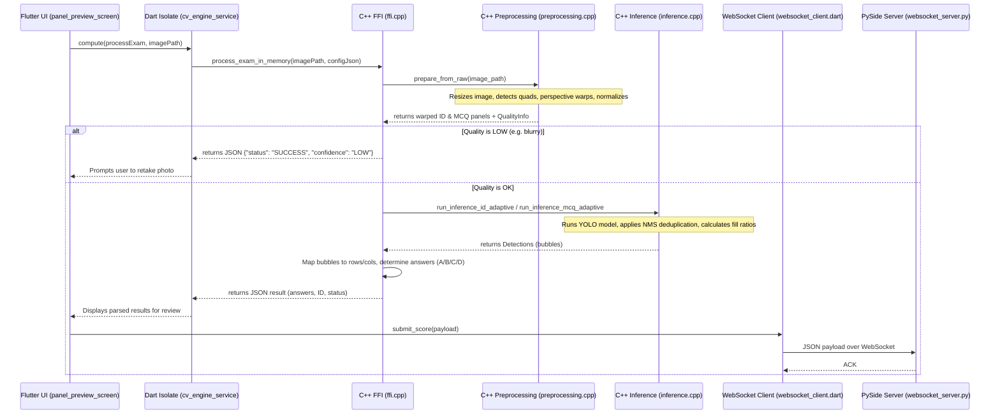

# Nexus Edge Grading System - Comprehensive Technical Documentation

## 1. Project Overview
Nexus Edge is a client-server Optical Mark Recognition (OMR) system designed to grade bubble sheet exams efficiently and accurately. 

**Purpose:** To automate the grading of paper-based multiple-choice exams.
**Target Platforms:** 
- Desktop (Windows/Linux/macOS) for the Admin Dashboard.
- Mobile (Android/iOS) for the Edge Client (Scanner).

**Core Use Case:** An instructor uses the desktop dashboard to configure an exam blueprint and start a grading session. Proctors/teachers use the mobile app to scan students' completed exam sheets. The mobile app processes the image locally using a neural-network-based CV engine to extract marked answers, then syncs the results in real-time over a local WebSocket connection back to the desktop dashboard.

---

## 2. Architecture

**Overall Style:** Client-Server, with a heavy edge-compute (Mobile) node and a localized Python/SQLite backend.

**Major Components:**
1. **Admin Dashboard (`core/admin_dashboard`)**: A PySide6 desktop application that holds the source of truth (SQLite database). It embeds a WebSocket server to receive grades and manages the UI for exam setup and session monitoring.
2. **Edge Client (`core/edge_client/lib`)**: A Flutter mobile application. It captures photos using the native camera, maintains session state, handles retry logic, and connects to the dashboard.
3. **CV Engine (`core/cv_engine`)**: A native C++ library loaded by Flutter via FFI. It handles heavy image preprocessing (OpenCV) and bubble detection (ONNX Runtime / YOLO).
4. *(Deprecated)* **Native CV (`core/edge_client/native_cv`)**: An older, OpenCV-heuristic-based OMR engine that relied on fixed templates and manual calibration, now superseded by `cv_engine`.

**Cross-Language Boundaries:** 
The Edge Client (Dart) communicates with the CV Engine (C++) via `dart:ffi`. Data is marshalled as JSON strings. This decouples the memory layouts and allows the C++ engine to flexibly evolve its internal structures without breaking strict ABI structs.

### End-to-End Request Sequence (Scanning a Sheet)



---

## 3. Dependencies

### Admin Dashboard (Python)
- **PySide6**: Core UI framework.
- **websockets**: Async WebSocket server for receiving edge client data.
- **sqlite-utils**: Database interaction (`grading_system.db`).
- **fastapi / uvicorn**: Potentially for extended API services.
- **qrcode / pillow**: Generating connection QR codes in the UI.

### Edge Client (Flutter)
- **provider**: State management and dependency injection.
- **ffi**: Foreign Function Interface to talk to the C++ engine.
- **web_socket_channel**: Network communication with the dashboard.
- **image_picker / mobile_scanner**: Camera interaction and QR scanning.
- **shared_preferences**: Local session and configuration caching.

### CV Engine (C++)
- **OpenCV 4** (`core`, `imgproc`, `imgcodecs`): Image manipulation, perspective warping, thresholding.
- **ONNX Runtime (C++ API)**: Executing the YOLO model for bubble detection.
- **nlohmann/json**: Header-only JSON serialization for the FFI boundary.

**Build-time vs Runtime:** 
The C++ CV Engine requires ONNX Runtime and OpenCV headers at build time. On Android, OpenCV is statically linked, but `libonnxruntime.so` is required at runtime. On Windows, `onnxruntime.dll` and `opencv_world4120d.dll` must be present alongside the executable/library at runtime.

---

## 4. Build & Run Instructions

### Admin Dashboard
1. `cd core`
2. `pip install -r requirements.txt`
3. `python main.py`

### CV Engine (Native)
1. Download and extract ONNX Runtime (C++ package).
2. `cd core/cv_engine`
3. `mkdir build && cd build`
4. `cmake .. -DONNXRUNTIME_ROOT="/path/to/onnxruntime"` (Specify `-DCMAKE_TOOLCHAIN_FILE` for Android).
5. `cmake --build . --config Release`
6. Output: `libai_corrector.so` (Linux/Android), `ai_corrector.dll` (Windows), `libai_corrector.dylib` (macOS).

### Edge Client (Flutter)
1. Ensure the built native library (`libai_corrector.so`, etc.) is placed in the respective platform-specific directories (`android/app/src/main/jniLibs`, etc.).
2. Ensure `shamel.onnx` is placed in `core/edge_client/assets/models/`.
3. `cd core/edge_client`
4. `flutter pub get`
5. `flutter run`

---

## 5. File-by-File Breakdown

### `core/admin_dashboard`
- **`main.py` / `dashboard.py`**: The application entry point and main PySide6 `QMainWindow` setup.
- **`project_manager.py`**: Handles SQLite DB ops (`grading_system.db`), project saving/loading, and exam configurations.
- **`workers/websocket_server.py`**: Embedded async server managing live connections from the Flutter app.
- **`pages/` & `screens/`**: Specific UI views (e.g., `SetupPage`, `SessionManagerPage`, `LoginScreen`).
- **`widgets/ip_share_card.py`**: Generates and displays the QR code for edge clients to connect.

### `core/cv_engine`
- **`include/ffi.h` & `src/ffi.cpp`**: The C-API boundary. Exposes `process_exam_in_memory` and `free_string`. Orchestrates the pipeline and formats the JSON response.
- **`src/preprocessing.cpp`**: Responsible for Stage 1 operations. Resizes images, detects panel quads using contours, validates geometry, and performs perspective warping (`stage2_warp`). Computes blur/quality scores.
- **`src/inference.cpp`**: Responsible for Stage 2 operations. Manages the ONNX Runtime session, runs YOLO inference (`infer_single`, `infer_tiled`), applies NMS (`dedup`), and estimates grid layouts (`estimate_mcq_grid`).
- **`src/questions.cpp`**: Maps the continuous coordinates of detected bubbles into discrete rows and columns. Determines if an option is blank, answered, or has multiple marks.
- **`src/grouping.cpp`**: Geometric clustering algorithms (`group_by_rows`, `group_by_columns`) to organize scattered YOLO detections into structured matrices based on a pixel tolerance.

### `core/edge_client`
- **`lib/main.dart`**: Composition root. Sets up Providers and initializes the app.
- **`lib/data/scanning/native_cv_bindings.dart`**: Raw Dart FFI definitions linking to `libai_corrector`.
- **`lib/data/scanning/cv_engine_service.dart`**: High-level wrapper that executes FFI calls on a background Isolate (`Isolate.run`) to prevent UI blocking.
- **`lib/data/connection/websocket_client.dart`**: Implements the WebSocket protocol matching the dashboard's `websocket_server.py`.
- **`lib/features/scanning/presentation/panel_preview_screen.dart`**: Renders the cropped panels for user verification.

---

## 6. Design Patterns & Principles

- **Dependency Injection / Inversion of Control**: The Flutter app heavily utilizes the `provider` package to inject abstract interfaces (e.g., `ScanEngineRepository`, `ConnectionRepository`) into controllers.
- **Facade Pattern**: `cv_engine_service.dart` acts as a facade over the low-level pointer management of `native_cv_bindings.dart`.
- **Pimpl Idiom (Opaque Pointers/Data)**: The C++ interface intentionally avoids exposing internal classes. It consumes paths/JSON and returns JSON.
- **SOLID Principles**: 
  - **SRP (Single Responsibility)**: Well followed in C++. `preprocessing.cpp` handles geometry/pixels; `inference.cpp` handles ML; `questions.cpp` handles business logic formatting.
  - **Dependency Inversion**: Flutter `ScanEngineRepository` interface separates UI from the C++ library.
- **Separation of Concerns**: The Admin Dashboard solely handles data truth and setup; the mobile client strictly acts as a stateless capture/compute node.

---

## 7. Features

- **Dynamic OMR Grid Processing**: Can process variable exam formats (configurable columns, questions, options) based on JSON configs, without needing a rigid fixed-coordinate template.
- **Edge AI Compute**: Runs YOLO models entirely on the mobile device, ensuring fast latency and privacy.
- **Auto-Orientation & Deskew**: Detects fiducials/boxes, corrects extreme perspective distortions, and rotates upside-down images automatically.
- **Adaptive Thresholding**: Analyzes local pixel density to differentiate between a filled bubble, an 'X' mark, or a blank bubble, mitigating lighting variances.
- **WebSocket Live Sync**: Instantaneous roster updates and score submissions to the local network dashboard.
- **Retake & Quality Guards**: The engine fails fast on blurry or incorrectly framed images, returning a quality score that prompts the user to retake before wasting CPU on heavy ML inference.

---

## 8. Public API Reference (C++ CV Engine)

### `process_exam_in_memory`
```c
AI_CORRECTOR_EXPORT const char* process_exam_in_memory(const char* image_path, const char* config_json);
```
- **Description**: The primary entry point. Preprocesses the image and runs inference.
- **Parameters**:
  - `image_path`: Absolute path to the raw photo.
  - `config_json`: JSON string conforming to `ExamConfig` (contains model path, grid sizes, ID format).
- **Returns**: A heap-allocated JSON string containing `status`, `confidence`, `questions`, and `id_columns`.
- **Memory Ownership**: **CALLEE ALLOCATES, CALLER OWNS**. The returned `char*` is allocated via `new char[]`. The caller (Dart) *must* pass it to `free_string` when done.
- **Invariants**: Can be called concurrently from multiple threads.

### `free_string`
```c
AI_CORRECTOR_EXPORT void free_string(char* str);
```
- **Description**: Safely frees memory allocated by the CV Engine to prevent cross-boundary allocator mismatches.

---

## 9. Error Handling & Failure Modes

- **C++ Engine**: Uses standard C++ exceptions internally. The FFI boundary (`ffi.cpp`) wraps the entire pipeline in a `try/catch`. Any exception is caught and serialized into a fallback JSON payload: `{"status": "ERROR", "message": "<e.what()>"}`.
- **Preprocessing Failures**: If corner quads are missing or the image is too blurry, `preprocessing.cpp` flags `is_ok = false` and appends warnings (e.g., `NO_ID_PANEL`, `BLUR`). The engine returns early, skipping ONNX inference to save CPU.
- **Dart FFI**: `cv_engine_service.dart` wraps the native call in a `try/catch`. If the native library segfaults, the isolate crashes, but the app avoids a complete halt (though segfaults are rare due to OpenCV boundary checks).
- **WebSocket Drops**: The Flutter app caches results locally (`session_cache_manager.dart`) and retries submissions when the connection is restored.

---

## 10. Concurrency & Threading Model

- **C++ Thread Safety**: `inference.cpp` maintains a static `session_map` of ONNX runtime sessions protected by a `std::mutex`. This allows multiple Dart isolates to concurrently request inference without corrupting the ONNX engine.
- **OpenCV Threading**: Uses `cv::setNumThreads(4)` during preprocessing.
- **Flutter (Dart)**: All FFI calls block the thread they run on. To maintain 60FPS UI, the Flutter app strictly offloads `process_exam_in_memory` to background isolates using `Isolate.run()`.

---

## 11. Security & Input Validation

- **Boundary Validation**: The C++ engine uses `nlohmann/json` which throws standard exceptions on malformed JSON. The FFI layer catches this.
- **File System**: `cv::imread` handles non-existent or corrupted image paths gracefully (returning an empty matrix, which is then caught and thrown as a `std::runtime_error`).
- **Network Boundaries**: WebSockets operate over local network IP (scanned via QR). No explicit TLS/encryption is enforced in this architecture, assuming a trusted local school/institution network.

---

## 12. Data/Model Versioning

- **ONNX Model**: The system relies on a bundled asset `shamel.onnx`. Updates to this model require pushing a new build of the Flutter app.
- **Schema Versions**: Config payloads expect specific JSON keys. Backwards compatibility is maintained (e.g., falling back to `num_question_columns` if the newer, authoritative `mcq_columns` map is missing, as noted in `MIGRATION_NOTES.md`).

---

## 13. Platform-Specific Behavior

- **Android**: `CMakeLists.txt` links OpenCV statically (`libopencv_*.a`) and utilizes `-Wl,--gc-sections` to trim unreachable code. This drops the binary size significantly (from ~38MB to minimal). `libonnxruntime.so` is linked directly.
- **Windows**: The dashboard runs on Windows. If compiling the C++ engine for desktop tests, it relies on post-build commands to copy `onnxruntime.dll` and `opencv_world4120d.dll` adjacent to the executable.
- **iOS/macOS**: Uses standard dylib linking. `DynamicLibrary.open` handles `.dylib` resolution.

---

## 14. Performance & Resource Budget

- **Image Resizing**: 12MP+ camera photos consume massive memory in OpenCV. `prepare_from_raw` aggressively downscales input images to `MAX_DIM = 1500` immediately to cap RAM usage and CPU cycles.
- **Early Exits**: ONNX inference (the most expensive operation) is skipped entirely if the preprocessing stage determines the image is unsalvageable (e.g., extreme blur).
- **ONNX Optimization**: Configured for mobile with `session_options.SetIntraOpNumThreads(4)` and `ORT_ENABLE_ALL` optimizations.
- **Tiling**: Large grids are processed using `infer_tiled` to maintain the fixed model resolution (`416x416`) across wide aspect ratios without losing small bubble details.

---

## 15. Testing & Validation

- **Current State**: There is a `tests` directory in `core/` and a `test_parse.dart` script in Flutter. 
- **Missing Coverage**:
  - Lack of automated unit tests for the C++ geometric grouping (`grouping.cpp`, `questions.cpp`).
  - No continuous integration (CI) tests that cross the FFI boundary (e.g., passing a test image from Dart and validating the JSON output).
  - Model regression testing (ensuring a new `shamel.onnx` doesn't drop accuracy on historical edge-case images).

---

## 16. Extensibility & Scaling Guide

**Adding a New Exam Layout:**
1. Update `project_manager.py` to define the new blueprint (e.g., adding a new section for True/False).
2. The Dashboard generates a new JSON configuration.
3. The CV Engine dynamically adapts. No C++ recompilation is needed because `inference.cpp` and `questions.cpp` build grid anchors dynamically based on the JSON `num_questions`, `num_choices`, and `mcq_column_sizes` parameters.

**Scaling:**
- The architecture scales horizontally on the edge. The server is lightweight (just receiving tiny JSON payloads), so one dashboard can handle hundreds of simultaneous mobile scanners in a gymnasium/classroom setting.

---

## 17. Known Issues / Technical Debt

- **Deprecated Engine**: The `native_cv` directory contains the old heuristic-based OpenCV engine. It is unused by the new Flutter client (see `MIGRATION_NOTES.md`) but remains in the repository, causing confusion.
- **Heuristic Reliance**: `group_by_rows` in C++ relies on a pixel tolerance (`row_tolerance_px`) to cluster detections. Highly warped or curved paper might still cause rows to bleed into each other.
- **JSON FFI Overhead**: Passing data via serialized JSON strings across FFI incurs parsing overhead on both sides, though it avoids brittle C-struct alignment issues.

---

## 18. Glossary

- **OMR**: Optical Mark Recognition. The process of detecting marked bubbles on paper.
- **FFI**: Foreign Function Interface. The mechanism Dart uses to call C++ code.
- **ONNX**: Open Neural Network Exchange. The format used for the YOLO bubble detection model.
- **YOLO**: You Only Look Once. A real-time object detection AI model used here to find bubbles.
- **Isolate**: Dart's version of a thread, featuring isolated memory. Used to run C++ code without freezing the UI.
- **NMS (Non-Maximum Suppression)**: Referred to as `dedup` in code; an algorithm to remove overlapping bounding box predictions from the AI model.
